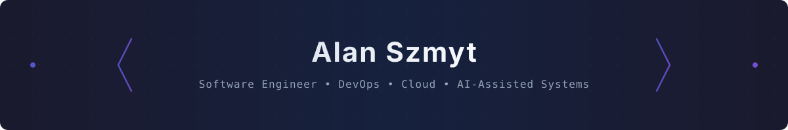

<a id="readme-top"></a>

<!-- ═══════════════════════════════════════════════════════════════════════════ -->
<!-- 🎯 HERO                                                                     -->
<!-- ═══════════════════════════════════════════════════════════════════════════ -->

<div align="center">



<br/>

[](https://github.com/szmyty?tab=followers)

[](https://github.com/szmyty?tab=repositories)
[](https://www.linkedin.com/in/alanszmyt)
[](https://szmyty.vercel.app)

</div>

---

<!-- ═══════════════════════════════════════════════════════════════════════════ -->
<!-- 🧭 NAVIGATION                                                               -->
<!-- ═══════════════════════════════════════════════════════════════════════════ -->

<details>
<summary><strong>Navigation</strong></summary>
<br/>

- [About](#-about)
- [Current Focus](#-current-focus)
- [GitHub Statistics](#-github-statistics)
- [Project Ecosystem](#️-project-ecosystem)
- [Organizations](#-organizations)
- [Featured Projects](#-featured-projects)
- [Engineering Principles](#️-engineering-principles)
- [Technology Stack](#️-technology-stack)
- [Research & Learning](#-research--learning)
- [Creative Technology](#-creative-technology)
- [Latest Activity](#-latest-activity)
- [Contact](#-contact)

</details>

---

<!-- ═══════════════════════════════════════════════════════════════════════════ -->
<!-- 👤 ABOUT                                                                    -->
<!-- ═══════════════════════════════════════════════════════════════════════════ -->

## 👤 About

<p>
Software engineer with a focus on cloud-native systems, developer experience,
AI-assisted tooling, and creative automation. I design platforms that are
intentional and composable — systems that give developers leverage and give
users clarity.
</p>

<p>
I think in systems. I care about the experience of building as much as the
experience of using. I value automation that removes friction rather than
adding ceremony, and documentation that reveals architecture rather than
restating code.
</p>

<p>
Outside of engineering: music producer, amateur researcher, and occasional
builder of things that blur the line between tools and art.
</p>

---

<!-- ═══════════════════════════════════════════════════════════════════════════ -->
<!-- 🔭 CURRENT FOCUS                                                            -->
<!-- ═══════════════════════════════════════════════════════════════════════════ -->

## 🔭 Current Focus

<table>
<tr>

<td width="50%" valign="top">

**🤖 AI Tooling & Agents**
Building production-grade AI agent workflows — structured prompting, tool
orchestration, and multi-agent coordination patterns using MCP and LLM APIs.

**📱 Flutter Foundation**
Designing a shared component and architecture foundation for cross-platform
Flutter applications. Emphasis on clean architecture, testability, and
maintainable design systems.

**🏠 Homelab & Infrastructure**
Local-first infrastructure with Kubernetes, Terraform, and GitOps workflows.
Building reproducible environments and developer tooling at home scale.

</td>

<td width="50%" valign="top">

**📄 Resume & Portfolio Generator**
Programmatic resume generation from structured YAML/JSON — LaTeX rendering,
PDF output, and a companion portfolio site.

**🔓 Open Source Contributions**
Contributing to developer tooling repositories and building reusable
open-source foundations for common engineering problems.

**📚 Knowledge Systems**
Exploring personal knowledge management, graph-based note systems, and
structured approaches to continuous learning.

</td>

</tr>
</table>

---

<!-- ═══════════════════════════════════════════════════════════════════════════ -->
<!-- 📊 GITHUB STATISTICS                                                        -->
<!-- ═══════════════════════════════════════════════════════════════════════════ -->

## 📊 GitHub Statistics

<!-- Generated artifacts live in .github/artifacts/github-stats/ -->
<!-- Produced by .github/workflows/github-stats.yml (lowlighter/metrics) -->

<div align="center">

<table>
<tr>

<td width="50%" align="center">


</td>

<td width="50%" align="center">


</td>

</tr>
</table>

<br/>


</div>

---

<!-- ═══════════════════════════════════════════════════════════════════════════ -->
<!-- 🗺️ PROJECT ECOSYSTEM                                                        -->
<!-- ═══════════════════════════════════════════════════════════════════════════ -->

## 🗺️ Project Ecosystem

My personal engineering landscape — interconnected projects that share
concepts, components, and vision.

```
Personal OS
│
├── 🧠 egohygiene          — Engineering foundations and self-maintenance system
├── 📱 Flutter Foundation  — Cross-platform mobile architecture foundation
├── 📄 Resume Generator    — Structured, programmatic resume and portfolio
├── 🤖 AI Tooling          — Agent frameworks, MCP integrations, LLM workflows
├── 🏠 Homelab             — Local-first infrastructure and reproducible dev environments
├── 🎵 Music Platform      — Creative tooling at the intersection of code and music
└── 🌐 Portfolio           — Engineering portfolio and public-facing identity
```

---

<!-- ═══════════════════════════════════════════════════════════════════════════ -->
<!-- 🏢 ORGANIZATIONS                                                            -->
<!-- ═══════════════════════════════════════════════════════════════════════════ -->

## 🏢 Organizations

<table align="center">
<tr>

<td width="50%" align="center" valign="top">

### [szmyty](https://github.com/szmyty)

Personal open-source engineering work.
Repositories, experiments, and public-facing projects.

</td>

<td width="50%" align="center" valign="top">

### [egohygiene](https://github.com/egohygiene)

Engineering infrastructure and self-maintenance systems.
Reusable patterns, documentation, and AI tooling foundations.

</td>

</tr>
</table>

---

<!-- ═══════════════════════════════════════════════════════════════════════════ -->
<!-- 🏆 FEATURED PROJECTS                                                        -->
<!-- ═══════════════════════════════════════════════════════════════════════════ -->

## 🏆 Featured Projects

<table>
<tr>

<td width="33%" align="center" valign="top">

### 🤖 OpenAI-Retro-SuperMarioWorld-SNES

NEAT-Python recurrent neural network that trains an AI agent to complete
levels in Super Mario World via OpenAI Gym Retro.

**Stack:** Python · NEAT · OpenAI Gym Retro

[](https://github.com/szmyty/OpenAI-Retro-SuperMarioWorld-SNES)

</td>

<td width="33%" align="center" valign="top">

### 🗣️ soliloquy

Privately chat with and summarize PDFs using a fully local LLM. No data
leaves your machine.

**Stack:** Python · Docker · Ollama

[](https://github.com/szmyty/soliloquy)

</td>

<td width="33%" align="center" valign="top">

### ⚙️ universal

All-in-one monorepo DX: formatting, linting, spellcheck, and CI-ready
automation in a single shell toolkit.

**Stack:** Shell · GitHub Actions

[](https://github.com/szmyty/universal)

</td>

</tr>
<tr>

<td width="33%" align="center" valign="top">

### 🧠 egohygiene

A mature engineering infrastructure repository: reusable foundations,
AI instructions, workflow patterns, and documentation systems.

**Stack:** Dart · Flutter · Python · GitHub Actions

[](https://github.com/egohygiene/egohygiene)

</td>

<td width="33%" align="center" valign="top">

### 🏠 Homelab

*In progress* — Kubernetes-based home infrastructure with GitOps workflows,
Terraform provisioning, and reproducible developer environments.

**Stack:** Kubernetes · Terraform · Ansible

[](https://github.com/szmyty)

</td>

<td width="33%" align="center" valign="top">

### 📄 Resume Generator

*In progress* — Programmatic resume generation from structured data with
LaTeX rendering, PDF export, and companion portfolio integration.

**Stack:** Python · LaTeX · YAML

[](https://github.com/szmyty)

</td>

</tr>
</table>

---

<!-- ═══════════════════════════════════════════════════════════════════════════ -->
<!-- 🏛️ ENGINEERING PRINCIPLES                                                   -->
<!-- ═══════════════════════════════════════════════════════════════════════════ -->

## 🏛️ Engineering Principles

<table>
<tr>

<td width="33%" valign="top">

**⚡ Automate the friction, not the thinking**
Good automation eliminates repeated manual work. It does not eliminate
judgment or design.

**🧩 Composable over monolithic**
Prefer small, independently useful units that compose well over large systems
that do everything and can be broken only together.

**📚 Self-documenting systems**
A system that explains itself through clear names, structure, and conventions
costs less to maintain than a system that depends on documentation to be
understood.

</td>

<td width="33%" valign="top">

**🔒 Secure and private by default**
Privacy and security are not features to add at the end. They are
constraints that shape the design from the beginning.

**🔄 Fast feedback loops**
A system that tells you quickly when something is wrong is a system you can
trust to improve. Slow feedback is how problems compound unseen.

**🎯 Design before automation**
Build and validate a static version of any feature before automating it.
Automation should reinforce a proven design, not determine it.

</td>

<td width="33%" valign="top">

**📈 Progressive complexity**
Start with the smallest architecture that satisfies the real requirements.
Add abstraction only when at least two concrete cases justify it.

**🌱 Continuous improvement over big rewrites**
Incremental improvements that ship are more valuable than large rewrites that
do not. Leave code and systems better than you found them.

**👥 Human-centered engineering**
Every technical decision affects a person. Clarity, usability, and developer
experience are engineering quality attributes, not afterthoughts.

</td>

</tr>
</table>

---

<!-- ═══════════════════════════════════════════════════════════════════════════ -->
<!-- 🛠️ TECHNOLOGY STACK                                                         -->
<!-- ═══════════════════════════════════════════════════════════════════════════ -->

## 🛠️ Technology Stack

<div align="center">

**Languages**

<p>


</p>

**Frameworks & Platforms**

<p>


</p>

**Infrastructure & Cloud**

<p>


</p>

**Data & Storage**

<p>


</p>

</div>

---

<!-- ═══════════════════════════════════════════════════════════════════════════ -->
<!-- 🔬 RESEARCH & LEARNING                                                      -->
<!-- ═══════════════════════════════════════════════════════════════════════════ -->

## 🔬 Research & Learning

Current areas of active exploration:

<table>
<tr>

<td width="50%" valign="top">

**🤖 AI Agents & Orchestration**
Multi-agent architectures, Model Context Protocol (MCP), structured reasoning,
and tool-use patterns for production LLM applications.

**🕸️ Knowledge Graphs & Local-First Systems**
Graph-based knowledge representation, CRDT-based local-first data models,
and offline-capable collaborative systems.

**🏗️ Platform Engineering**
Internal developer platforms, golden paths, and the tooling that gives
engineering teams compounding leverage.

</td>

<td width="50%" valign="top">

**📐 Formal Methods (lightweight)**
Property-based testing, invariant-driven design, and the practical
application of formal thinking to systems architecture.

**🧠 Developer Experience Research**
Cognitive load in software engineering, feedback loop design, and tooling
that respects the developer's attention.

**🔒 Privacy-Preserving Systems**
Differential privacy, federated learning foundations, and architectures
that collect only what they need.

</td>

</tr>
</table>

---

<!-- ═══════════════════════════════════════════════════════════════════════════ -->
<!-- 🎵 CREATIVE TECHNOLOGY                                                      -->
<!-- ═══════════════════════════════════════════════════════════════════════════ -->

## 🎵 Creative Technology

Engineering and creativity are not separate domains.

I produce music and build tools at their intersection — algorithmic
composition, generative audio experiments, and systems that blur the boundary
between instrument and software.

Current interests:

- Generative music using probabilistic models and Markov chains.
- MIDI tooling and algorithmic arrangement.
- Audio synthesis and DSP concepts in software.
- AI-assisted composition (as a creative collaborator, not a replacement).

---

<!-- ═══════════════════════════════════════════════════════════════════════════ -->
<!-- ⚡ LATEST ACTIVITY                                                           -->
<!-- ═══════════════════════════════════════════════════════════════════════════ -->

## ⚡ Latest Activity

<!-- This section is updated automatically by the activity workflow. -->
<!-- START_SECTION:activity -->
<!--
  Activity feed will be generated here once the activity module workflow is active.
  See docs/ROADMAP.md Phase 4 — activity module.
-->
<!-- END_SECTION:activity -->

---

<!-- ═══════════════════════════════════════════════════════════════════════════ -->
<!-- 📫 CONTACT                                                                  -->
<!-- ═══════════════════════════════════════════════════════════════════════════ -->

## 📫 Contact

<div align="center">

[](https://www.linkedin.com/in/alanszmyt)
[](https://szmyty.vercel.app)
[](https://github.com/szmyty)
[](https://github.com/szmyty/szmyty/issues)

</div>

---

<!-- ═══════════════════════════════════════════════════════════════════════════ -->
<!-- 🔻 FOOTER                                                                   -->
<!-- ═══════════════════════════════════════════════════════════════════════════ -->

<div align="center">


<br/>

[⬆️ Back to Top](#readme-top)

</div>
