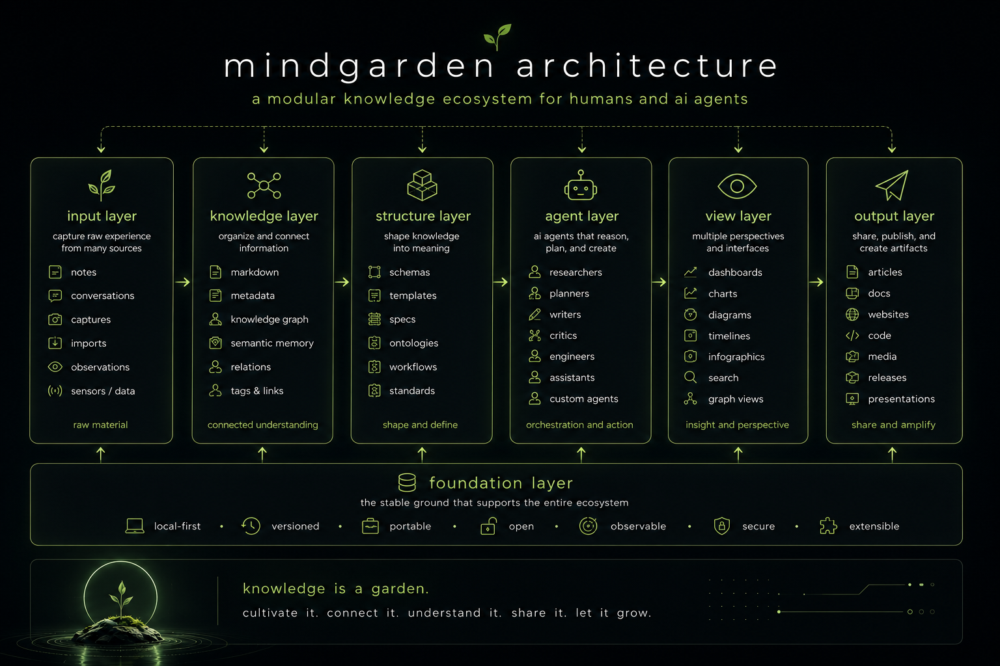

<a id="readme-top"></a>

<div align="center">
  <a href="https://github.com/egohygiene/mindgarden">
    
  </a>

  <h1 align="center">mindgarden</h1>

  <p align="center">
    <strong>A living exploration of AI agents, digital gardens, knowledge systems, and human creativity.</strong>
    <br />
    <br />
    <a href="#-system-context"><strong>Explore the Concept »</strong></a>
    <br />
    <br />
    <a href="https://egohygiene.io/mindgarden">Website</a>
    &middot;
    <a href="https://github.com/egohygiene/mindgarden/issues">Ideas & Issues</a>
    &middot;
    <a href="https://github.com/egohygiene/mindgarden/discussions">Discussions</a>
  </p>

  <div align="center">
    <a href="https://github.com/egohygiene/mindgarden/blob/main/LICENSE"></a>
    
    
    
    
  </div>
</div>

---

## 🧭 System Context

> **Meaning Over Data:** `mindgarden` is an exploration of how humans, AI agents, memory, context, digital gardens, and open-source systems can work together over time.

This repository is currently an architecture and research space for developing a generalized framework around:

* AI agent harnesses
* digital gardens
* personal knowledge management
* knowledge graphs
* semantic memory
* specification-driven workflows
* open-source knowledge infrastructure
* human-AI collaboration

The goal is not simply to store information.

The goal is to cultivate insight.

<p align="right">(<a href="#readme-top">back to top</a>)</p>

## 🌱 Core Idea

A mind garden is a living knowledge system where notes, conversations, specs, schemas, diagrams, reflections, and creative artifacts all become part of an evolving context layer.

At a high level:

```text
Human Experience
    ↓
Capture
    ↓
Knowledge Nodes
    ↓
Insight Extraction
    ↓
Specs / Views / Artifacts
    ↓
Reflection
    ↓
Evolving Context
```

The system is designed around the belief that AI-native tools should not replace human creativity.

They should help humans clarify, compress, connect, and express what they already understand.

<p align="right">(<a href="#readme-top">back to top</a>)</p>

## 🧠 Architectural Principles

* **Open Source First:** Knowledge infrastructure should be transparent, forkable, and extensible.
* **Human-Centered:** The human remains the source of intent, meaning, and direction.
* **Context as Infrastructure:** Context should be treated as a first-class architectural concern.
* **Schemas as Stabilizers:** Specs, templates, and schemas help transform ambiguity into structure.
* **Agent-Compatible:** Knowledge should be organized so humans and AI agents can both navigate it.
* **Version Everything:** Understanding evolves, and the system should preserve that history.
* **Local-First Where Possible:** The foundation should remain portable and user-owned.
* **Meaning Over Data:** Information matters most when it becomes insight, action, or expression.

<p align="right">(<a href="#readme-top">back to top</a>)</p>

## 🏗 Conceptual Architecture

`mindgarden` is not currently a finished application. It is an evolving architecture for a modular knowledge and agent ecosystem.

```text
mindgarden/

├── knowledge layer
│   ├── markdown notes
│   ├── digital garden content
│   ├── structured metadata
│   ├── knowledge graph concepts
│   └── semantic memory
│
├── structure layer
│   ├── specs
│   ├── schemas
│   ├── templates
│   ├── workflows
│   └── architecture documents
│
├── agent layer
│   ├── planners
│   ├── researchers
│   ├── writers
│   ├── critics
│   ├── engineers
│   └── custom assistants
│
├── view layer
│   ├── obsidian
│   ├── quartz
│   ├── dashboards
│   ├── charts
│   ├── infographics
│   └── generated artifacts
│
└── publishing layer
    ├── websites
    ├── documentation
    ├── articles
    ├── diagrams
    └── open-source repositories
```

<div align="center">
  
</div>

<br />

<p align="right">(<a href="#readme-top">back to top</a>)</p>

## 🛠 Potential Stack

This project is intentionally stack-aware but not stack-locked.

| Layer                | Candidate Tools                                              |
| :------------------- | :----------------------------------------------------------- |
| **Authoring**        | Obsidian, VS Code, Markdown                                  |
| **Publishing**       | Quartz, GitHub Pages                                         |
| **Agent Harness**    | OpenCode, GitHub Copilot, custom agents                      |
| **Knowledge Graph**  | Neo4j, Memgraph, RDF/SPARQL, Markdown links                  |
| **Semantic Memory**  | Qdrant, Chroma, LanceDB, pgvector                            |
| **Structured Data**  | YAML, JSON, Markdown frontmatter, JSON Schema                |
| **Automation**       | GitHub Actions, shell scripts, task runners                  |
| **Visualization**    | Mermaid, Excalidraw, Charts, infographics                    |
| **Creative Systems** | ComfyUI, generative media pipelines, creative workflow tools |

The implementation may change over time.

The architectural goal is stable:

```text
Human Intent
    ↕
Conversation
    ↕
Memory
    ↕
Structure
    ↕
Artifact
```

<p align="right">(<a href="#readme-top">back to top</a>)</p>

## 🗺 Roadmap

* [x] Create the initial `mindgarden` repository.
* [x] Define the early concept and visual identity.
* [ ] Add initial architecture diagrams.
* [ ] Create `ARCHITECTURE.md`.
* [ ] Define the first knowledge schema.
* [ ] Prototype an Obsidian-based garden bootstrap.
* [ ] Explore Quartz publishing.
* [ ] Document the AI agent harness model.
* [ ] Prototype insight-to-view workflows.
* [ ] Explore charts, dashboards, and infographic generation.
* [ ] Extract reusable templates for other personal gardens.

<p align="right">(<a href="#readme-top">back to top</a>)</p>

## 🤝 Contributing

This repository is currently in an exploratory phase.

Ideas, discussions, references, diagrams, and architectural feedback are welcome.

If you are interested in:

* digital gardens
* AI-native knowledge systems
* personal knowledge management
* agent memory
* open-source tooling
* creative operating systems
* human-AI collaboration

feel free to open an issue or discussion.

<p align="right">(<a href="#readme-top">back to top</a>)</p>

## 📜 License

Distributed under the MIT License. See [`LICENSE`](LICENSE) for more information.

<p align="right">(<a href="#readme-top">back to top</a>)</p>

## 📡 Contact

**Alan R. Szmyt**
Software architect focused on AI-native systems, cross-platform applications, developer experience, knowledge systems, platform engineering, and human-AI collaboration.

* GitHub: [@szmyty](https://github.com/szmyty)
* Organization: [Ego Hygiene](https://github.com/egohygiene)
* Website: https://egohygiene.io

Project Link: https://github.com/egohygiene/mindgarden

<p align="right">(<a href="#readme-top">back to top</a>)</p>
