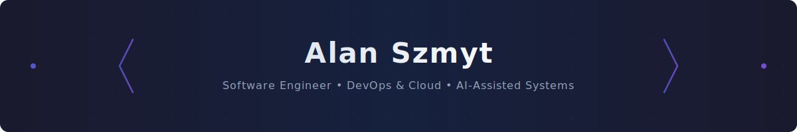

<!-- ═══════════════════════════════════════════════════════════════════════════ -->
<!-- 🎯 HERO SECTION                                                            -->
<!-- ═══════════════════════════════════════════════════════════════════════════ -->

<!-- Branded Header Banner -->

 
 

<!-- Badges Row 1 -->

<!-- Badges Row 2 -->

 

<!-- ═══════════════════════════════════════════════════════════════════════════ -->
<!-- 📊 METRICS DASHBOARD                                                        -->
<!-- ═══════════════════════════════════════════════════════════════════════════ -->

## 📊 Metrics Dashboard

<table>
<tr>
<td width="50%" align="center">
  

</td>
<td width="50%" align="center">

 

</td>
</tr>
</table>

 

<!-- ═══════════════════════════════════════════════════════════════════════════ -->
<!-- 👤 ABOUT ME                                                                 -->
<!-- ═══════════════════════════════════════════════════════════════════════════ -->

## 👤 About Me

<table align="center">
<tr>
<td width="100%">

> 🚀 Passionate software engineer with expertise in building scalable systems, cloud infrastructure, and AI-powered solutions. I thrive on solving complex problems and creating elegant, maintainable code.

**Currently focused on:**
- 🔭 Building robust DevOps pipelines and cloud-native applications
- 🌱 Exploring AI/ML integration in software development workflows
- 💡 Contributing to open-source projects and developer tools

*📝 Full resume coming soon...*

</td>
</tr>
</table>

 

<!-- ═══════════════════════════════════════════════════════════════════════════ -->
<!-- 💡 DEVELOPER EXPERIENCE                                                      -->
<!-- ═══════════════════════════════════════════════════════════════════════════ -->

## 💡 Developer Experience

<table align="center">
<tr>
<td width="33%" align="center" valign="top">

### 🎯 DX Philosophy

> *Great developer experience is the foundation of great software.*

**Principles I Live By:**
- ⚡ Automate the mundane
- 🔄 Fast feedback loops
- 📚 Self-documenting code
- 🧩 Composable architectures

</td>
<td width="33%" align="center" valign="top">

### 🏛️ Engineering Pillars

> *Building on solid foundations for lasting impact.*

**Core Values:**
- 🔒 Security by design
- 📈 Scalability first
- 🧪 Test-driven quality
- 🔧 Continuous improvement

</td>
<td width="33%" align="center" valign="top">

### 🚀 What I Build

> *Crafting tools and systems that empower developers.*

**Focus Areas:**
- 🛠️ Developer tooling & CLIs
- ☁️ Cloud-native platforms
- 🤖 AI-assisted workflows
- 🔁 CI/CD pipelines

</td>
</tr>
</table>

 

<!-- ═══════════════════════════════════════════════════════════════════════════ -->
<!-- 🛠️ TECH STACK                                                               -->
<!-- ═══════════════════════════════════════════════════════════════════════════ -->

## 🛠️ Tech Stack

<!-- Tech Icon Grid -->

  &nbsp;&nbsp;
  &nbsp;&nbsp;
  &nbsp;&nbsp;
  &nbsp;&nbsp;
  &nbsp;&nbsp;
  

  &nbsp;&nbsp;
  &nbsp;&nbsp;
  &nbsp;&nbsp;
  &nbsp;&nbsp;
  &nbsp;&nbsp;
  &nbsp;&nbsp;
  

 

### Languages

### Frameworks & Libraries

### DevOps & Cloud

### Tools & Platforms

 

<!-- ═══════════════════════════════════════════════════════════════════════════ -->
<!-- 🏆 FEATURED PROJECTS                                                        -->
<!-- ═══════════════════════════════════════════════════════════════════════════ -->

## 🏆 Featured Projects

<table align="center">
<tr>
<td width="50%" valign="top">

### 📦 Project Name 1
> *Short description of the project and what it does.*

[📂 View Repository](#)

</td>
<td width="50%" valign="top">

### 📦 Project Name 2
> *Short description of the project and what it does.*

[📂 View Repository](#)

</td>
</tr>
<tr>
<td width="50%" valign="top">

### 📦 Project Name 3
> *Short description of the project and what it does.*

[📂 View Repository](#)

</td>
<td width="50%" valign="top">

### 📦 Project Name 4
> *Short description of the project and what it does.*

[📂 View Repository](#)

</td>
</tr>
</table>

 

<!-- ═══════════════════════════════════════════════════════════════════════════ -->
<!-- ⚡ RECENT ACTIVITY                                                          -->
<!-- ═══════════════════════════════════════════════════════════════════════════ -->

## ⚡ Recent Activity

<!--START_SECTION:activity-->
1.  Assigned issue [#7](https://github.com/szmyty/szmyty/issues/7) in [szmyty/szmyty](https://github.com/szmyty/szmyty)
<!--END_SECTION:activity-->

 

<!-- ═══════════════════════════════════════════════════════════════════════════ -->
<!-- 📫 FOOTER                                                                   -->
<!-- ═══════════════════════════════════════════════════════════════════════════ -->

---

 

 

*Made with ❤️ by Alan*

