<!-- ═══════════════════════════════════════════════════════════════════════════ -->
<!-- 🎯 HERO SECTION                                                            -->
<!-- ═══════════════════════════════════════════════════════════════════════════ -->

<!-- Branded Header Banner -->

  

<!-- Badges Row -->

 

<!-- ═══════════════════════════════════════════════════════════════════════════ -->
<!-- 📊 METRICS DASHBOARD (CLEAN CONSOLIDATED VERSION)                          -->
<!-- ═══════════════════════════════════════════════════════════════════════════ -->

## 📊 Metrics Dashboard

All GitHub statistics below are <strong>self-hosted</strong> using lowlighter/metrics — no external API downtime.

<table>
<tr>

<!-- Overview -->
<td width="33%" align="center">

</td>

<!-- Stats -->
<td width="33%" align="center">

</td>

<!-- Languages -->
<td width="33%" align="center">

</td>

</tr>
</table>

 

<!-- Contributions / Streaks -->

  

<!-- Full metrics -->

 

<!-- ═══════════════════════════════════════════════════════════════════════════ -->
<!-- 👤 ABOUT ME                                                                 -->
<!-- ═══════════════════════════════════════════════════════════════════════════ -->

## 👤 About Me

🚀 Software engineer focusing on cloud-native systems, developer experience, creative automation, and AI-assisted tooling.  
I build high-quality, scalable platforms with strong emphasis on automation, security, and clarity.

 

<!-- ═══════════════════════════════════════════════════════════════════════════ -->
<!-- 💡 DEVELOPER EXPERIENCE                                                      -->
<!-- ═══════════════════════════════════════════════════════════════════════════ -->

## 💡 Developer Experience

<table align="center">
<tr>

<td width="33%" align="center" valign="top">

### 🎯 DX Philosophy  
- ⚡ Automate the mundane  
- 🔄 Fast feedback loops  
- 📚 Self-documenting code  
- 🧩 Composable architectures  

</td>

<td width="33%" align="center" valign="top">

### 🏛️ Engineering Pillars  
- 🔒 Secure by default  
- 📈 Scalable by design  
- 🧪 Test-driven quality  
- 🔧 Continuous improvement  

</td>

<td width="33%" align="center" valign="top">

### 🚀 What I Build  
- 🛠 Developer tooling & CLIs  
- ☁ Cloud-native platforms  
- 🤖 AI-augmented workflows  
- 🔁 CI/CD & automation systems  

</td>

</tr>
</table>

 

<!-- ═══════════════════════════════════════════════════════════════════════════ -->
<!-- 🛠️ TECH STACK                                                               -->
<!-- ═══════════════════════════════════════════════════════════════════════════ -->

## 🛠️ Tech Stack

<!-- Icon Grid -->

  
  
  
  
  
  

  
  
  
  
  
  

 

<!-- ═══════════════════════════════════════════════════════════════════════════ -->
<!-- 🏆 FEATURED PROJECTS                                                        -->
<!-- ═══════════════════════════════════════════════════════════════════════════ -->

## 🏆 Featured Projects

<table align="center">
<tr>

<td width="33%" align="center">

### 📱 android-app  
> Native Android application with modern architecture and Material Design.

</td>

<td width="33%" align="center">

### 🐍 python-pipeline  
> Automated ETL pipeline with containerized deployment.

</td>

<td width="33%" align="center">

### 📊 react-dashboards  
> Interactive data visualization dashboards using React + D3.js.

</td>

</tr>
</table>

 

<!-- ═══════════════════════════════════════════════════════════════════════════ -->
<!-- ⚡ RECENT ACTIVITY                                                          -->
<!-- ═══════════════════════════════════════════════════════════════════════════ -->

## ⚡ Recent Activity

<!--START_SECTION:activity-->
1.  Assigned issue [#69](https://github.com/szmyty/profile/issues/69) in [szmyty/profile](https://github.com/szmyty/profile)
2. ❗ Opened issue [#69](https://github.com/szmyty/profile/issues/69) in [szmyty/profile](https://github.com/szmyty/profile)
3.  Assigned issue [#50](https://github.com/szmyty/theatre/issues/50) in [szmyty/theatre](https://github.com/szmyty/theatre)
4. 🔒 Closed issue [#66](https://github.com/szmyty/theatre/issues/66) in [szmyty/theatre](https://github.com/szmyty/theatre)
5.  Assigned issue [#66](https://github.com/szmyty/theatre/issues/66) in [szmyty/theatre](https://github.com/szmyty/theatre)
<!--END_SECTION:activity-->

 

<!-- ═══════════════════════════════════════════════════════════════════════════ -->
<!-- 🤖 AUTOMATION & WORKFLOWS                                                   -->
<!-- ═══════════════════════════════════════════════════════════════════════════ -->

## 🤖 Automation & Workflows

This profile is automatically updated daily using GitHub Actions.

| Workflow | Description | Status |
|----------|-------------|--------|
| [Metrics](/.github/workflows/metrics.yml) | Generates GitHub metrics SVG |  |
| [Update README](/.github/workflows/update-readme.yml) | Updates recent activity |  |
| [Profile Cards](/.github/workflows/profile-summary-cards.yml) | Summary cards generation |  |

 

<!-- ═══════════════════════════════════════════════════════════════════════════ -->
<!-- 📫 FOOTER (NEW — NOT HEADER REUSED)                                         -->
<!-- ═══════════════════════════════════════════════════════════════════════════ -->

  

 

*Made with ❤️ by Alan*

