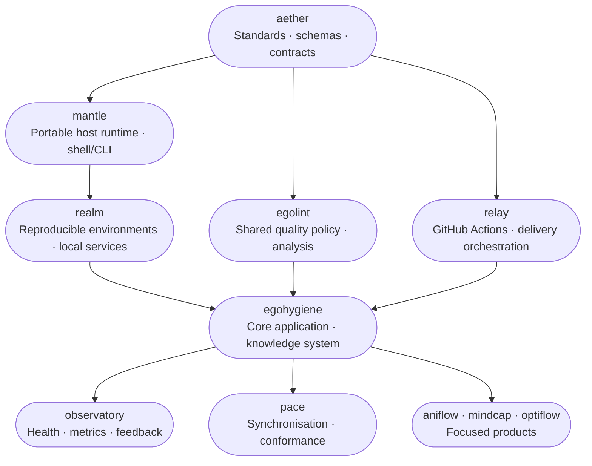

<!-- ════════════════════════════════════════════════════════════════════════════ -->
<!-- 1. HERO                                                                     -->
<!-- ════════════════════════════════════════════════════════════════════════════ -->

<!-- Banner: replace banner-light.svg / banner-dark.svg with final ChatGPT-generated artwork.
     Critical identity text is preserved as Markdown below so it remains readable
     even when the images do not load. See assets/profile/ASSET-BRIEF.md. -->
<picture>
  <source media="(prefers-color-scheme: dark)"  srcset="assets/profile/banner-dark.svg">
  <source media="(prefers-color-scheme: light)" srcset="assets/profile/banner-light.svg">
  
</picture>

# Alan Szmyt

**Software Engineer · Systems Architect · Creative Technologist**

---

<!-- ════════════════════════════════════════════════════════════════════════════ -->
<!-- 2. THIRTY-SECOND BRIEF                                                      -->
<!-- ════════════════════════════════════════════════════════════════════════════ -->

## Brief

I build **cloud-native platforms**, **developer experience tooling**, and
**AI-assisted workflows** with a strong emphasis on privacy, automation, and
long-term maintainability.

I think in systems. I care about the experience of building as much as the
experience of using. I value automation that removes friction rather than adding
ceremony, and documentation that reveals architecture rather than restating code.

---

<!-- ════════════════════════════════════════════════════════════════════════════ -->
<!-- 3. PROOF AT A GLANCE                                                        -->
<!-- ════════════════════════════════════════════════════════════════════════════ -->

## Proof at a Glance

| Claim | Evidence ID | Public Artifact |
|-------|-------------|-----------------|
| Software engineer | `identity-role-software-engineer` | [github.com/szmyty](https://github.com/szmyty) |
| Open-source systems builder | `repo-soliloquy` · `repo-universal` · `repo-openai-retro` | [szmyty repositories](https://github.com/szmyty?tab=repositories) |
| Ego Hygiene organisation contributor | `repo-egohygiene-org` · `oss-egolint-pr` | [github.com/egohygiene](https://github.com/egohygiene) |
| Local-LLM tooling (soliloquy) | `repo-soliloquy` | [szmyty/soliloquy](https://github.com/szmyty/soliloquy) |
| Monorepo DX tooling (universal) | `repo-universal` | [szmyty/universal](https://github.com/szmyty/universal) |
| AI game agent (NEAT / gym-retro) | `repo-openai-retro` | [OpenAI-Retro-SuperMarioWorld-SNES](https://github.com/szmyty/OpenAI-Retro-SuperMarioWorld-SNES) |
| Shared linting contribution | `repo-egolint` · `oss-egolint-pr` | [egohygiene/egolint](https://github.com/egohygiene/egolint) |
| Evidence catalog | `repo-szmyty-szmyty` | [profile/content/evidence.yml](profile/content/evidence.yml) |

---

<!-- ════════════════════════════════════════════════════════════════════════════ -->
<!-- 4. SELECTED IMPACT                                                          -->
<!-- ════════════════════════════════════════════════════════════════════════════ -->

## Selected Impact

> Each entry below is backed by an inspectable public artifact.
> Evidence IDs reference [profile/content/evidence.yml](profile/content/evidence.yml).

| Area | Context · Ownership · Outcome | Evidence |
|------|-------------------------------|----------|
| **Offline-first LLM chat** | Without a budget for cloud API calls or a willingness to send private documents to third-party servers, designed and built [soliloquy](https://github.com/szmyty/soliloquy) — a single Docker Compose stack that routes PDF queries through a locally running LLM. Outcome: a reproducible, zero-cloud-dependency workflow that any developer can run with one command. | `repo-soliloquy` · [github.com/szmyty/soliloquy](https://github.com/szmyty/soliloquy) |
| **Monorepo developer experience** | Across multiple projects with inconsistent formatting, linting, and CI conventions, authored [universal](https://github.com/szmyty/universal) — a composable shell toolkit that consolidates formatting, linting, spellcheck, and CI scaffolding. Outcome: a single source of DX conventions that can be layered into any repository without bespoke setup. | `repo-universal` · [github.com/szmyty/universal](https://github.com/szmyty/universal) |
| **Reinforcement-learning experiment** | To understand emergent agent behaviour from raw game-state input, trained a NEAT recurrent neural network to navigate SNES Super Mario World levels using gym-retro. Outcome: a publicly documented experiment showing the training loop, configuration, and results in a reproducible form. | `repo-openai-retro` · [github.com/szmyty/OpenAI-Retro-SuperMarioWorld-SNES](https://github.com/szmyty/OpenAI-Retro-SuperMarioWorld-SNES) |
| **Shared linting infrastructure** | To reduce lint-rule drift across repositories in the Ego Hygiene organisation, contributed and merged the initial opinionated rule set in [egolint](https://github.com/egohygiene/egolint). Outcome: a shared linting baseline that any organisation repository can inherit, reducing per-repo configuration overhead. | `repo-egolint` · `oss-egolint-pr` · [egohygiene/egolint#1](https://github.com/egohygiene/egolint/pull/1) |

---

<!-- ════════════════════════════════════════════════════════════════════════════ -->
<!-- 5. FEATURED SYSTEMS                                                         -->
<!-- ════════════════════════════════════════════════════════════════════════════ -->

## Featured Systems

> Maturity labels: **Stable** = released and maintained · **Active dev** =
> usable but evolving · **Experiment** = documented, not production-intended.
> Each entry links to an inspectable public artifact. Evidence IDs reference
> [profile/content/evidence.yml](profile/content/evidence.yml).

---

### [soliloquy](https://github.com/szmyty/soliloquy) · Active dev

**Problem:** Querying private documents against a cloud LLM exposes confidential
content to third-party servers and incurs ongoing API costs.

**Approach:** A single Docker Compose stack — Ollama for local model serving,
a Python ingestion layer, and a query interface — that processes PDFs entirely
on-device. No data leaves the host machine.

**Alan's role:** Designed the compose architecture, selected Ollama as the
local runtime, and structured the ingestion pipeline to be document-type-agnostic.

**Stack:** Python · Docker · Ollama · Vector store

**Evidence:** [`repo-soliloquy`](https://github.com/szmyty/soliloquy) ·
[`docs/projects/soliloquy.md`](docs/projects/soliloquy.md)

---

### [universal](https://github.com/szmyty/universal) · Active dev

**Problem:** Configuration drift across multiple repositories — inconsistent
formatting, linting, spellcheck, and CI conventions — compounds onboarding cost
and maintenance burden.

**Approach:** A composable shell toolkit that centralises DX conventions.
Repositories inherit shared configurations by layering, not forking, keeping
the source of truth in one place.

**Alan's role:** Identified drift as the root cause, designed the composition
model, and structured GitHub Actions templates as parameterisable reusable
workflows.

**Stack:** Shell · GitHub Actions · Formatter and linter configurations

**Evidence:** [`repo-universal`](https://github.com/szmyty/universal) ·
[`docs/projects/universal.md`](docs/projects/universal.md)

---

### [OpenAI-Retro-SuperMarioWorld-SNES](https://github.com/szmyty/OpenAI-Retro-SuperMarioWorld-SNES) · Experiment

**Problem:** Understanding reinforcement learning requires a concrete,
observable experiment with a clear reward signal and reproducible setup.

**Approach:** NEAT-Python evolves recurrent neural networks to control a Super
Mario World agent via OpenAI gym-retro. A fixed configuration file and
checkpoint system make every training run reproducible.

**Alan's role:** Configured NEAT hyperparameters, wrote the fitness function
translating game progress to a scalar reward, and documented the training loop
and results for public inspection.

**Stack:** Python · NEAT-Python · OpenAI gym-retro

**Evidence:** [`repo-openai-retro`](https://github.com/szmyty/OpenAI-Retro-SuperMarioWorld-SNES) ·
[`docs/projects/openai-retro.md`](docs/projects/openai-retro.md)

---

### [egohygiene](https://github.com/egohygiene/egohygiene) · Active dev

**Problem:** Building a personal knowledge and habit system across multiple
devices requires a consistent data model and a local-first design that keeps
all personal data off third-party cloud servers.

**Approach:** A cross-platform Flutter application backed by a Drift/SQLite
local store, situated at the centre of a multi-repository developer platform
(the Ego Hygiene organisation) with clearly layered responsibilities.

**Alan's role:** Defined the ecosystem architecture, selected Drift ORM for
local-first persistence, and established the shared linting baseline via
`egolint`.

**Stack:** Dart · Flutter · TypeScript · Python · GitHub Actions · SQLite

**Evidence:** [`repo-egohygiene-org`](https://github.com/egohygiene) ·
[`docs/projects/egohygiene.md`](docs/projects/egohygiene.md)

---

### [szmyty/szmyty](https://github.com/szmyty/szmyty) · Active dev

**Problem:** GitHub profile READMEs routinely contain unverified claims.
Maintaining a truthful, evidence-backed profile requires a structured catalog
and automated validation.

**Approach:** This repository — schema-validated YAML evidence catalog,
automated checks, and the structured README you are reading — treats the
profile itself as a verifiable system.

**Stack:** Python · YAML · GitHub Actions · Markdown

**Evidence:** [`repo-szmyty-szmyty`](https://github.com/szmyty/szmyty) ·
[`profile/content/evidence.yml`](profile/content/evidence.yml)

---

<!-- ════════════════════════════════════════════════════════════════════════════ -->
<!-- 6. EGO HYGIENE ECOSYSTEM                                                    -->
<!-- ════════════════════════════════════════════════════════════════════════════ -->

## Ego Hygiene Ecosystem

[Ego Hygiene](https://github.com/egohygiene) is a developer platform
organised as a set of composable, clearly layered repositories — not a
collection of unrelated projects. Each repository owns a specific
responsibility and exposes a well-defined interface to the others.

### Architecture map

```mermaid
graph TD
    A([aether\nStandards · schemas · contracts]) --> B([mantle\nPortable host runtime · shell/CLI])
    A --> C([egolint\nShared quality policy · analysis])
    A --> D([relay\nGitHub Actions · delivery orchestration])
    B --> E([realm\nReproducible environments · local services])
    E --> F([egohygiene\nCore application · knowledge system])
    C --> F
    D --> F
    F --> G([observatory\nHealth · metrics · feedback])
    F --> H([pace\nSynchronisation · conformance])
    F --> I([aniflow · mindcap · optiflow\nFocused products])
```

### Layer reference

| Layer | Repository | Plain-language responsibility | Interface | Maturity |
|-------|------------|-------------------------------|-----------|----------|
| Foundation | [`aether`](https://github.com/egohygiene/aether) | Standards, contracts, policies, schemas, and reusable knowledge shared across the ecosystem | YAML/JSON schemas; documented contracts | Early |
| Runtime | [`mantle`](https://github.com/egohygiene/mantle) | Portable host runtime — shell and CLI behaviour, dotfile conventions, and environment bootstrapping | Shell scripts; environment hooks | Active dev |
| Environments | [`realm`](https://github.com/egohygiene/realm) | Reproducible local environments and service orchestration — "the same stack everywhere" | Docker Compose; devcontainer | Active dev |
| Quality | [`egolint`](https://github.com/egohygiene/egolint) | Shared linting rules and quality policy inherited by all organisation repositories | ESLint / Ruff rule exports | Usable — [PR #1 merged](https://github.com/egohygiene/egolint/pull/1) |
| Delivery | [`relay`](https://github.com/egohygiene/relay) | Reusable GitHub Actions workflows and release engineering orchestration | GitHub Actions reusable workflows | Early |
| Conformance | [`pace`](https://github.com/egohygiene/pace) | Synchronisation and conformance checking across repositories | CLI / CI check | Planned |
| Observability | [`observatory`](https://github.com/egohygiene/observatory) | Health, metrics, and continuous feedback across the platform | Dashboard / API | Planned |
| Core app | [`egohygiene`](https://github.com/egohygiene/egohygiene) | Core application and knowledge system — the primary user-facing product | Flutter app; local SQLite | Active dev |
| Products | `aniflow` · `mindcap` · `optiflow` | Focused products built on the platform for animation, cognition, and optimisation workflows | App / CLI | Early / Planned |

> **Reading this table as a first-time visitor:** Start at `aether` (the rules
> layer), move through `mantle` (how code runs locally), `realm` (how
> environments are reproduced), and `relay` (how code is delivered), then
> arrive at `egohygiene` (the product) and its satellite products.
> `egolint`, `pace`, and `observatory` are cross-cutting — they apply
> quality, conformance, and observability across the whole platform.

---

<!-- ════════════════════════════════════════════════════════════════════════════ -->
<!-- 7. ENGINEERING CAPABILITIES                                                 -->
<!-- ════════════════════════════════════════════════════════════════════════════ -->

## Engineering Capabilities

| Domain | Skills | Representative artifact |
|--------|--------|------------------------|
| **Languages** | Python · TypeScript · Dart · Java · Bash · SQL | [szmyty repos](https://github.com/szmyty?tab=repositories) |
| **Platforms** | Flutter · Docker · Linux · Android · Node.js | [soliloquy](https://github.com/szmyty/soliloquy) |
| **Data** | SQLite · PostgreSQL · Drift ORM | [egohygiene](https://github.com/egohygiene/egohygiene) |
| **CI/CD & automation** | GitHub Actions · Task · Poetry · FVM | [universal](https://github.com/szmyty/universal) |
| **AI / ML** | Local LLM integration · NEAT · gym-retro | [OpenAI-Retro-SuperMarioWorld-SNES](https://github.com/szmyty/OpenAI-Retro-SuperMarioWorld-SNES) |
| **DX practices** | Specification-driven development · Architecture-first design · Conventional Commits | [szmyty/szmyty](https://github.com/szmyty/szmyty) |

---

<!-- ════════════════════════════════════════════════════════════════════════════ -->
<!-- 8. EXPERIENCE AND EDUCATION                                                 -->
<!-- ════════════════════════════════════════════════════════════════════════════ -->

## Experience and Education

Employment history is held under a confidentiality policy and is not published
here. The public record of applied skills is the open-source portfolio above.

Education details will be added when a verified public artifact exists.

> See [profile/content/evidence.yml](profile/content/evidence.yml) for the
> complete evidence catalog and verification status of each claim.

---

<!-- ════════════════════════════════════════════════════════════════════════════ -->
<!-- 9. OPEN SOURCE AND COLLABORATION                                            -->
<!-- ════════════════════════════════════════════════════════════════════════════ -->

## Open Source and Collaboration

- Personal repositories and experiments: [github.com/szmyty](https://github.com/szmyty)
  — [evidence: `identity-github-username`]
- Ego Hygiene organisation: [github.com/egohygiene](https://github.com/egohygiene)
  — publicly accessible multi-repository developer platform [evidence: `repo-egohygiene-org`]
- Merged PR in egolint establishing shared lint conventions:
  [egohygiene/egolint#1](https://github.com/egohygiene/egolint/pull/1)
  — inspectable contribution history [evidence: `oss-egolint-pr`]

Contributions, issues, and discussions welcome. See open issues in this
repository at [szmyty/szmyty/issues](https://github.com/szmyty/szmyty/issues).

---

<!-- ════════════════════════════════════════════════════════════════════════════ -->
<!-- 10. CREATIVE PRACTICE                                                       -->
<!-- ════════════════════════════════════════════════════════════════════════════ -->

## Creative Practice

Music production, sound design, and generative audio are a continuous thread
through my work. Creative technology — the intersection of code, sound, and
interactive media — is not separate from my engineering practice; it informs it.

The `.play()` project is an ongoing effort to build personal creative
infrastructure: automation pipelines for music composition and production,
generative tooling for audio and visual media, and workflows that connect
creative process to the same engineering discipline applied elsewhere.

*Incompris* is a musical project exploring ambient and electronic composition.
Public releases, media pipeline experiments, and generative tooling will be
linked here as they become publicly available.

The feedback loop matters: constraints discovered while building creative
pipelines surface requirements for the engineering platform; solutions from the
engineering platform reduce friction in the creative workflow.

---

<!-- ════════════════════════════════════════════════════════════════════════════ -->
<!-- 11. CURRENT FOCUS                                                           -->
<!-- ════════════════════════════════════════════════════════════════════════════ -->

## Current Focus

| Stream | Description |
|--------|-------------|
| **AI tooling and agents** | Production-grade agent workflows: structured prompting, tool orchestration, and multi-agent coordination |
| **Developer experience** | Composable monorepo scaffolds, shared linting, and CI automation foundations |
| **Offline-first systems** | Local LLM integrations and privacy-preserving data patterns |
| **Knowledge systems** | Structured approaches to personal knowledge management and continuous learning |

---

<!-- ════════════════════════════════════════════════════════════════════════════ -->
<!-- 12. CONTACT                                                                 -->
<!-- ════════════════════════════════════════════════════════════════════════════ -->

## Contact

| Channel | Address |
|---------|---------|
| **GitHub** | [@szmyty](https://github.com/szmyty) |
| **Organisation** | [github.com/egohygiene](https://github.com/egohygiene) |

---

---

Profile composed per the evidence-first engineering standard defined in
<a href="https://github.com/szmyty/szmyty/issues/65">szmyty/szmyty#65</a>.
Evidence catalog: <a href="profile/content/evidence.yml">profile/content/evidence.yml</a>.

---

<!-- START:github-metrics -->
<!-- END:github-metrics -->

<!-- START:recent-activity -->
<!-- END:recent-activity -->

<!-- START:music-highlight -->
<!-- END:music-highlight -->

<!-- START:education -->
<!-- END:education -->

<!-- START:resume -->
<!-- END:resume -->

<!-- START:orcid -->
<!-- END:orcid -->

<!-- START:medium -->
<!-- END:medium -->

<!-- START:working-style -->
<!-- END:working-style -->

<!-- START:soundcloud -->
<!-- END:soundcloud -->

<!-- START:steam -->
<!-- END:steam -->

<!-- START:stars -->
<!-- END:stars -->

<!-- START:oura-trends -->
<!-- END:oura-trends -->
