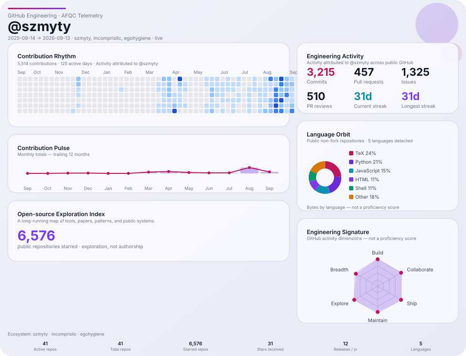
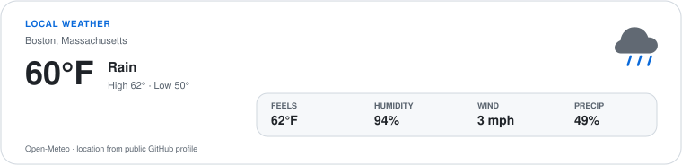
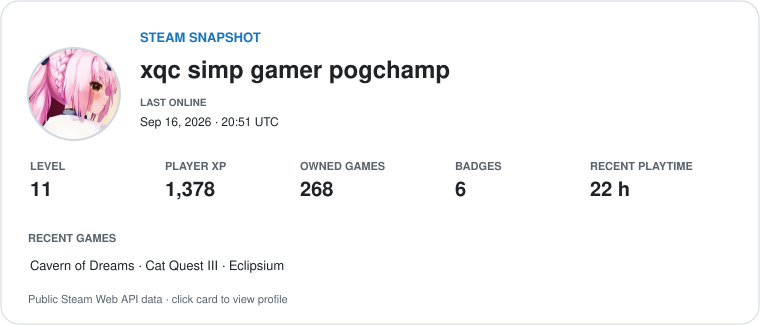
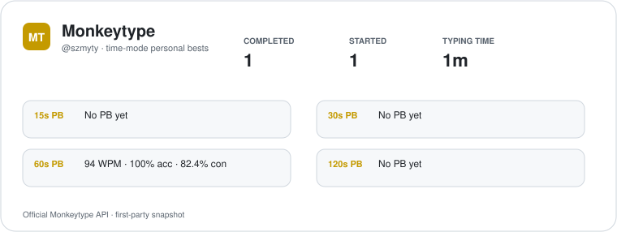
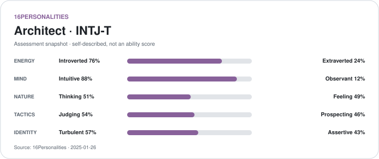

<picture>
  <source media="(prefers-color-scheme: dark)" srcset="assets/profile/banner-dark.svg">
  <source media="(prefers-color-scheme: light)" srcset="assets/profile/banner-light.svg">
  
</picture>

<h1>Alan Szmyt</h1>

  <strong>Software engineer building reliable developer platforms, local-first systems, and AI-assisted workflows.</strong> 
  Platform engineering · Developer experience · Research software · Creative technology

  
  
  
  

  
  
  
  
  
  
  
  
  
  
  

  
  

---

## Selected systems

<table>
  <tr>
    <td width="50%" valign="top">
      <a href="https://github.com/egohygiene/reflector"><strong>Reflector</strong></a> 
      Governed, auditable AI-assisted research software with manuscript and DOI-backed archive workflows.
    </td>
    <td width="50%" valign="top">
      <a href="https://github.com/egohygiene/renderflow"><strong>Renderflow</strong></a> 
      A Rust document-rendering engine built around explicit specifications and graph-planned transformations.
    </td>
  </tr>
  <tr>
    <td width="50%" valign="top">
      <a href="https://github.com/egohygiene/relay"><strong>Relay</strong></a> 
      Versioned GitHub Actions, reusable workflows, and CI contracts for a multi-repository engineering ecosystem.
    </td>
    <td width="50%" valign="top">
      <a href="https://github.com/egohygiene/optiflow"><strong>Optiflow</strong></a> 
      A local-first, read-only Rust CLI for media inventory and evidence-backed duplicate planning.
    </td>
  </tr>
</table>

These systems meet inside [**Ego Hygiene**](https://github.com/egohygiene), my public engineering and research lab for developer infrastructure, local-first tools, research software, and reusable automation.

---

## Public engineering, in context

<!-- START:github-dashboard -->
<picture>
  <source media="(prefers-color-scheme: dark) and (max-width: 767px)" srcset="./profile/artifacts/github-dashboard/card-mobile-dark.svg">
  <source media="(prefers-color-scheme: light) and (max-width: 767px)" srcset="./profile/artifacts/github-dashboard/card-mobile-light.svg">
  <source media="(prefers-color-scheme: dark)" srcset="./profile/artifacts/github-dashboard/card-dark.svg">
  <source media="(prefers-color-scheme: light)" srcset="./profile/artifacts/github-dashboard/card-light.svg">
  
</picture>

_First-party public GitHub data · trailing 365 days · refreshed 2026-08-26. Starred repositories are shown as an exploration index, not an authorship or proficiency claim._
<!-- END:github-dashboard -->

---

## Live telemetry

These cards are generated first-party from public or explicitly approved API data. Synthetic fixtures are used for tests only and are never presented as live profile data.

<!-- START:weather -->

### Weather where I am

<picture>
  <source media="(prefers-color-scheme: dark) and (max-width: 767px)" srcset="./profile/artifacts/weather/card-mobile-dark.svg">
  <source media="(prefers-color-scheme: light) and (max-width: 767px)" srcset="./profile/artifacts/weather/card-mobile-light.svg">
  <source media="(prefers-color-scheme: dark)" srcset="./profile/artifacts/weather/card-dark.svg">
  <source media="(prefers-color-scheme: light)" srcset="./profile/artifacts/weather/card-light.svg">
  
</picture>

Location follows my public GitHub profile · weather data by [Open-Meteo](https://open-meteo.com/) · no coordinates are stored.
<!-- END:weather -->

<!-- START:steam -->

### Gaming

<a href="https://steamcommunity.com/profiles/76561198068207368/" title="Open my Steam profile"><picture>
  <source media="(prefers-color-scheme: dark) and (max-width: 767px)" srcset="./profile/artifacts/steam/card-mobile-dark.svg">
  <source media="(prefers-color-scheme: light) and (max-width: 767px)" srcset="./profile/artifacts/steam/card-mobile-light.svg">
  <source media="(prefers-color-scheme: dark)" srcset="./profile/artifacts/steam/card-dark.svg">
  <source media="(prefers-color-scheme: light)" srcset="./profile/artifacts/steam/card-light.svg">
  
</picture></a>

Public Steam Web API data · availability follows my Steam privacy settings.
<!-- END:steam -->

<!-- START:monkeytype -->

### Typing

<a href="https://monkeytype.com/profile/szmyty" title="Open my Monkeytype profile"><picture>
  <source media="(prefers-color-scheme: dark) and (max-width: 767px)" srcset="./profile/artifacts/monkeytype/card-mobile-dark.svg">
  <source media="(prefers-color-scheme: light) and (max-width: 767px)" srcset="./profile/artifacts/monkeytype/card-mobile-light.svg">
  <source media="(prefers-color-scheme: dark)" srcset="./profile/artifacts/monkeytype/card-dark.svg">
  <source media="(prefers-color-scheme: light)" srcset="./profile/artifacts/monkeytype/card-light.svg">
  
</picture></a>

Official Monkeytype API · aggregate typing activity and selected time-mode personal bests · [view profile](https://monkeytype.com/profile/szmyty)
<!-- END:monkeytype -->

<!-- START:oura-trends -->

<!-- END:oura-trends -->

---

<!-- START:working-style -->

## Personality & working style

<a href="https://www.16personalities.com/profiles/366f5f0cddbe1" title="Open my 16Personalities profile"><picture>
  <source media="(prefers-color-scheme: dark) and (max-width: 767px)" srcset="./profile/artifacts/working-style/card-mobile-dark.svg">
  <source media="(prefers-color-scheme: light) and (max-width: 767px)" srcset="./profile/artifacts/working-style/card-mobile-light.svg">
  <source media="(prefers-color-scheme: dark)" srcset="./profile/artifacts/working-style/card-dark.svg">
  <source media="(prefers-color-scheme: light)" srcset="./profile/artifacts/working-style/card-light.svg">
  
</picture></a>

Self-described personality-assessment context · not a clinical, ability, or professional-fit measure · [view profile](https://www.16personalities.com/profiles/366f5f0cddbe1)
<!-- END:working-style -->

---

## How I work

I use **AI-assisted implementation inside bounded, reviewable workflows**. I own the architecture, constraints, review, validation, and release decisions.

---

## Contact

For professional inquiries, use the [contact route on my portfolio](https://szmyty.vercel.app). For project-specific questions, open an issue in the relevant public repository.

<!-- Optional surfaces stay hidden until each claim and destination passes its launch gate. -->
<!-- START:ai-agent-showcase -->
<!-- END:ai-agent-showcase -->
<!-- START:music-highlight -->
<!-- END:music-highlight -->
<!-- START:orcid -->
<!-- END:orcid -->
<!-- START:medium -->
<!-- END:medium -->
<!-- START:education -->
<!-- END:education -->
<!-- START:resume -->
<!-- END:resume -->
<!-- START:soundcloud -->
<!-- END:soundcloud -->
<!-- START:stars -->
<!-- END:stars -->
